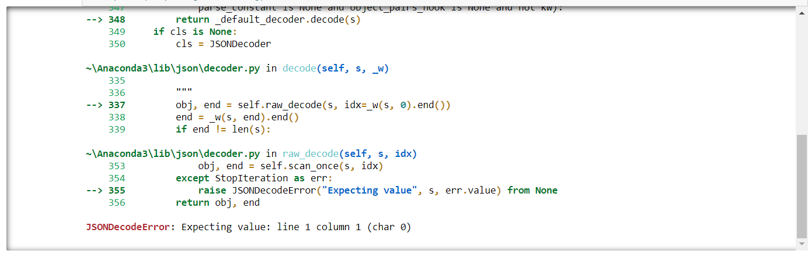
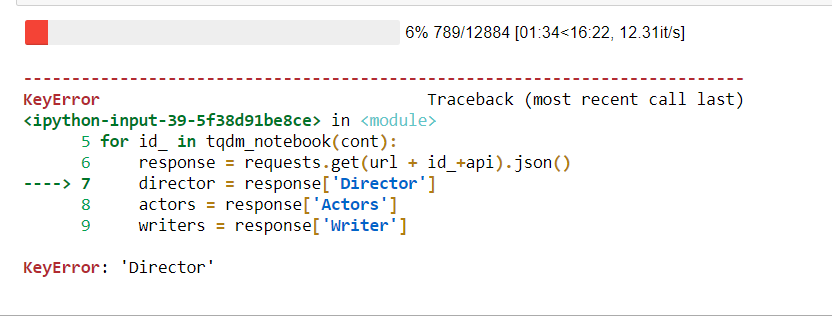

# ETL-Project - Movie Database
Project Team : Martha Aguilar and John Hawkins

### Files included
+ ETL_Movie_Data_ERD - ERD of the movies_db
* ETL_Film_Project_MAGU - Schema code for movies_db
- Movies_ETL-MAG.ipynb - Jupyter Notebook Python Code file used for development of the movies_metadata.csv data extraction, authored by Martha Aguilar
+ movies_metadata - CSV file with data to be extracted by Movies_ETL-MAG.ipynb
* unique_indmID.csv - File of imdb_id's used to run API calls during development
- Folder OMDB
  - OMDB_Data.ipynb - Jupyter Notebook Python Code file used for development of the OMDB API data calls, authored by John Hawkins and improvements made with the assistance of Martha Aguilar.
  - actor_df.csv - Output file of actor data used as backup
  - director_df.csv - Output file of director data used as backup
  - film_actor_df.csv - Output file of film_acotor data used as backup
  - film_director_df.csv - Output file of film_director data used as backup
  - film_writer_df.csv - Output file of film_writer data used as backup
  - writer_df.csv - Output file of writer data used as backup

               
### Project Description

The purpose of this project was to **E**xtract **C**lean and **L**oad (**ETL**) data from two sources.  The data chosen for this project was extracted form two sources, the first was is a movie data csv file located on kaggle at https://www.kaggle.com/rounakbanik/the-movies-dataset.  The second data set was extracted using the imdb_id's located in the csv files to extract additional data using OMDB API calls.   Follow is a description of the various steps taken to accomplish this.

###**E**xtract 
The data contained in the movie data csv file was in csv format but presented challenges to extract that column data into a                usable format.  Some snapshots of what the data format looked like prior to extraction into a pandas DataFrame is shown below.

In total there were xxx categories of data extracted from this data set.  The code which specifically associates with this csv is located within the repository and titled Movies_ETL.ipynb.

The data extracted from OMDB API calls was generated and extracted by using a list of imdb_id's to make API calls which were then stored as lists of dictionaries.  The data calls had a JSON format to them.  An example is shown below.  There was further cleaning of the data accomplished in the same step as the extraction, but this will be discussed later.  In all 45,415 calls were made with two calls containing no data, this iteration took approximately 1-1.5 hours to accomplish.

Other issues that arose during the API calls were errors associated with what I assume was the API call being made this often resulted in the error below.  Another error pictured below that caused the loop to crash was having no data resent for the requested response, in both cases the code was able to be restarted from the point it crashed, a try except calls were included later that seems to have worked to alleviate the issues.

- **C**lean
The data cleaning and organization portion of the project for both the movie_metadata and OMDB API calls data presented the majority of the challenge in this exercise.

XXXXXXX SPEAK ABOUT MOVIE_METADATA CLEANINGXXXXXXX.  

Regarding the data cleaning for the API calls, during the first version of the code the data was extracted and placed in a single list of dictionaries format, then separated to datasets and parsing of names and other dating accomplished by the use of multiple iterrow loops.  This presented a major issue with time, the original API calls took over 1 hour to perform and then each preceding iterrow loop took an additional hour to complete.  The code was then refined to do the majority of the parsing and data manipulation within the original API call loop.

-**L**oad
After completion of the extract and clean functions the data was then loaded into a Postgres Database via a sqlalchemy engine session being opened up with the pre-existing movies_db database and associated tables being present.

###Conclusions

This was a challenging project and presented team members with challenges that were not thought to be that great when the project started.  Issues with data cleaning and ensuring that code is efficient were learned.
