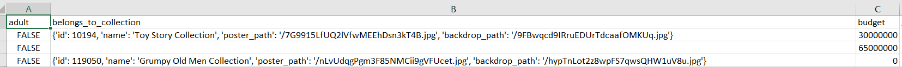
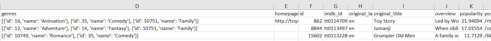

# ETL-Project - Movie Database
Project Team : Martha Aguilar and John Hawkins

<h3> Files included</h3>
* ETL_Movie_Data_ERD - ERD of the movies_db
* ETL_Film_Project_MAGU - Schema code for movies_db
* Movies_ETL-MAG.ipynb - Jupyter Notebook Pyton Code file used for development of the movies_metadata.csv data extraction, authored by Martha Aguilar
-

               
<h3>Project Description</h3>

The purpose of this project was to **E**xtract **C**lean and **L**oad (**ETL**) data from two sources.  The data chosen for this project was extracted form two sourses, the first was is a movie data csv file located on kaggle at https://www.kaggle.com/rounakbanik/the-movies-dataset.  The second data set was extracted using the imdb_id's located in the csv files to extract additioanl data usin OMDB API calls.   Follow is a description of the various steps taken to accomplish this.

-  Extract 
The data contained in the movie data csv file was in csv format but presented challenges to extract that column data into a                usable format.  Some snapshots of what the data format looked like prior to extraction into a pandas DataFrame is shown below.

In total there were xxx categories of data extracted from this data set.  The code which specifically associates wtih this csv is located within the reposity and titled Movies_ETL.ipynb.
